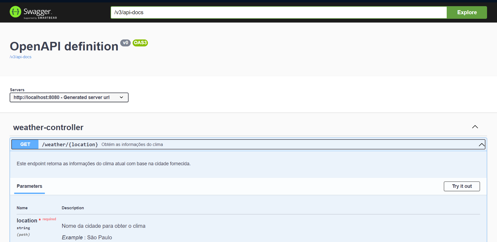

# Projeto RAIN-DAY em JAVA

O projeto proposto tem como função se conectar a uma API de localização, pegar as coordenadas, se conectar com a API de tempo e verificar as temperaturas e qualidades do clima atual.

## Requisitos

- Java 17
- Maven
- API KEY: [Weather API](https://openweathermap.org/api)

### Criar arquivo com api key
Antes de utilizar o sistema, deve-se entrar no site, se cadastrar e pegar uma key (grátis).
Crie um arquivo config.properties na raiz do projeto, e coloque sua chave:
```shell
echo "API_KEY=sua_chave" > config.properties
```

## Build

```shell
mvn clean install
```

## Execução
```shell
mvn spring-boot:run
```

## Documentação online (OpenAPI)

http://localhost:8080/swagger-ui/index.html/



## Tecnologias utilizadas:
- Java 17
- Spring Boot 3.3
- Gson 2.10
- Swagger
